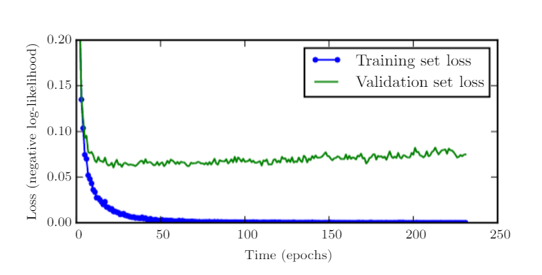

# Regularization Methods

## Introduction
The main problem we were facing here is overfitting and methods to avoid that.
The definition of Reguralization is the following: 

Define Regularization as “any modification we make to a learning algorithm that is intended to reduce its generalization error but not its training error.”

We talked about several Reguralization technics:

## Parameter Norm Penalties
The main idea here is to limit the  model complexity by adding a parameter norm penalty, denoted as Ω(θ), to the objective function J:
$ \tilde{J}(\theta;X, y) = J(\theta;X, y) + \alpha\Omega(\theta)$. 

Most importantly, parameter θ represents the weights only and not the biases.

## $L_1$, $L_2$ Regularization

$L_1$ (a.k.a Least Absolute Shrinkage and Selection Operation - LASSO) and $L_2$ (a.k.a Ridge, Tikonohov, Weight Decay) Regularizations update the general cost function $J$ by adding a term known as the regularization term $\alpha$. 
Because of $\alpha$ the values of weights decrease as it assumes that a neural network with smaller weights leads to non complex models. 
Therefore, it will also help in reducing overfitting in an efficient manner.

In $L_2$, we have:

$ \tilde{J}(w;X, y) = \frac{\alpha}{2}w^Tw + J(w;X,y) $

Here, alpha serves as the regularization parameter.  It is known as hyperparameter, and it's value is optimized for efficient results. $L_2$ regularization is also known as weight decay as it decrease the weights towards zero but not exactly at 0.

In $L_1$, we have:

$ \tilde{J}(w;X, y) = \alpha \| w\|_1 + J(w;X,y)$

Unlike $L_2$, We can reduce the weight to eactly 0 here.

## Data Augmentation

Here the problem of a limited data supply is faced. Assume an application where the model is complex and needs more training data, but aquiring new data is costly or even impossible (e.g. thousand of additional annotated images or patient data). Data Augmentation tries to solve this problem by generating artificial new data points from the existing one. This can be done by adding small amounts of noise where a human could not tell the difference. 

The important thing to pay attention here is that the copied and alternated datapoint has gets the correct annotation. 
Considering Computer Vision (espacially object recognition tasks) the following are the most popular Data Augmentation Techniques:

1. Flip
2. Rotation
3. Scale
4. Crop
5. Zoom

Those tasks provide a powerful tool but as mentioned have to be used carefully because e.g. when detecting letters a flip or rotation can convert a "d" easily to a "b".

## Noise Robustness

We can impose a penalty on the norm of the weights by adding a noise with extremely small variance. Similarly, we can also add noise to weights. 
There are some interpretations about it. Among several, one interpretation is that when we add noise to weights, it will be considered as the 
stochastic implementation of Bayesian inference over the weights. In this case, the weights are not known. Probability distribution is used to model the uncertainity.
As learning will become stable and efficient, so it is considered as a type of Regularization. 

For example, consider a linear regression case, in order to reduce mean squared error, for each vector x, we can learn to map y(x). 

$J = E_{p(x,y)}{[}(\hat{y}{(x)}{-}y)^2{]} $

If we add Gaussion random noise (ϵ) with zero mean to the weights. In such case, we are still interested to learn to reduce the mean square by proper mapping. 

Including noise in the weights is simply like adding regularization Ω(θ). Due to which, weights are not really affected due to small perturbations in the weights. This helps in stabilising the training. 

## Early Stopping

Consider overfitting as a decrement in training error and an increment in validation error as soon as we have a model complexity with high representation. 

So, in such scenario, the best thing to do is to get back to previous point, where we had a low validation error. In order to check for improvement, with each epoch, we have to keep track of validation metrics and keep saving the parameter configuration. When the training ends, the parameter which was saved at the end is returned. With that one tries to capture the minimum of the validation set loss function (see the following picture)

Similar is the case with Early stopping. With some known or fixed iterations, when there is no improvement in the validation error, then we try to terminate or finish the algorithm.
The capacity or complexity of the model is efficiently reduced with the number of reduced steps to fit the model. 

One of its comparison with weight decay is that in weight decay, we had to work with the coefficient of weight decay manually by tweaking it. Often with 
wrong chosen coefficient of weight decay, we can lead to local minima by suppressing the values of the weights very much.

In Early stopping, we don't need such manual setting of coefficient of weights for tuning. Early stopping is considered equivalent to $L_2$ Regularization. 

## Parameter Tying/Share and Dropout
Another way of implementing prior knowledge into the training process. 

### Parameter Tying
Express that certain parameters should be close to each other taken from two different models $A$ and $B$. 

Changing their loss functions with the additive Regularization term: $\Omega(w^{(A)}, w^{(B)}) := \vert\vert w^{(A)}-w^{(B)} \vert\vert_2^2$

### Parameter Sharing
Here we force sets of parameters in one (or multiple models) to be equal. Used for examples Heavy in CNN training, where the feature detectors of one layer get set on the same parameter set. 

The Advantage here is the massive reduction of space (brings the ability to train larger models) and another implement of prior knowledge. It gives the opporunity to detect features in e.g. pictures independently of their position, with reasonable extra efford for training. 

### Dropout
Here we improve generalization and speed up the model training by training the ensemble of all sub-networks of a NN. 

Where a subnet is a subgraph of the original NN connecting (at least some) input neurons to the output. 
When training a subnet its weights are shared with the original net. 

Since there are exponentially many subnets of a NN it is not possible to train them all. In fact when dealing even with mid size nets one will be only able to train a tiny fraction of that set. So for each training process a subnet get sampled in the following way. Select each non ouput neuron $n$ in layer $l$ with probability $p_l$ ($p_l$ for the input layer is usually high with $0.8$ and $0.5$ for the other layers). 

The resulting training routine is then: Sampling subnet, Training subnet, adjust wheigts in original net and iterate.

The resulting NN can now not be used for prediction with normal forward propagation since e.g. each of the disjoint subnets were trained independently to solve the task so their predictions would add up ending up in a wrong result. One can get around by with an extra trick:
Predict new data points by usual forward propagation but with each weight $w$ in layer $l$ multiplied by $p_l$.

In conclusion Dropout provides a cheap Regularization method (implementable in $\mathcal{O}(n)$), 
which forces the model to generalize since it is trained with subnets which have various topologies and a smaller capacity.

## Adverserial Training
Motivation: There a many models capable of reaching (or even exceeding) 
human performance on specific tasks (as Chess or GO). But do they also gather a human understandment of the game?

No they don't. That can be seen very well on object recognition tasks. 
Here often a little noise applied to the input image (barely distinguishable by a human), leads to a huge change in prediction. Those are called Adversarial examples. 
Such an example can be seen in the following picture. That sample comes from Googles LeNet (2014). One can see an image of a panda on the left on which the net has a relatively high confidence in recognizing the right animal. Adding a little bit of noise (in direction of the Gradient at the sample) the net is now very confident to recognize a gibbon even though the difference between the two samples is barely distinguishable by a human. 

By training a model on many Adversarial examples one tries to force the model to implement a prediction stable plateau around each of the training data points, 
because prior knowledge tells us that two different object in an image have a larger distance regarding the pixel values than a little noise could inject.

## Questions

### Q: Can you give an example where dataset augmentation is not appropriate?  
A: It is not appropriate when the transformation would change the correct class. You can see this e.g. on slide 7. If we rotate a six 180°, then it would be impossible to distinguish the digits 6 and 9.

### Q: How do I decide how many supervised and unsupervised examples do I take to train a semi-supervised model?  
A: This question cannot be answered in general, it depends on the model. You have to try different proportions of supervised and unsupervised examples and take a proportion that yields good results.

### Q: Is it better to use the geometric or arithmetic mean when we do inference?  
A: We mainly use the geometric mean. It usually improves the performance.

### Q: What is the difference between dropout training and bagging.  
A: They are similar in many ways. We infer from an ensemble of models. Some differences: In the case of bagging, all models are independent and is trained till convergence. In the case of dropout only a small fraction of the subnetworks are trained.

### Q: What is the advantage of label smoothing? Are there any disadvantages?
A: Label smoothing prevents the pursuit of hard probabilities without discouraging correct classification. The disadvantage of label smoothing is that it lowers the quality of the training data a little bit.

### Q: What is the significant cost of choosing hyperparameter automatically via early stopping? Is there any additional cost?
A: The only significant cost is is running the validation set evaluation periodically during training. An additional cost is the need to maintain a copy of the best parameters.

### Q: In the context of early stopping, which parameters learn earlier than others?
A: Parameters that correspond to directions of significant curvature tend to learn early relative to parameters corresponding to directions of less curvature.

### Q: What is the advantage of early stopping over weight decay?
A: Early stopping automatically determines the correct amount of regularization while weight decay requires many training experiments with different values of its hyperparameter.

### Q: When is the noise injection more powerful than simply shrinking the parameters?
A: When it is added to the hidden units.

### Q: When is dropout less effective?
A: It is less effective when extremely few labeled training examples are available. Also, unsupervised feature learning can gain an advantage over dropout when additional unlabeled data is available.

### Q: Why is the main power of dropout related to hidden layers?
A: It comes from the fact that the masking noise is applied to the hidden units. This can be seen as a form of highly intelligent, adaptive destruction of the information content of the input rather than destruction of the raw values of the input.

### Q: During adverserial training how do we find the examples where we add little noise and the output is quiet different?
A: In general, there is no clear answer yet how exactly list all adverserial examples and how they are exactly functioning. Linearity is one of the answers but it was also criticized in some literature.
