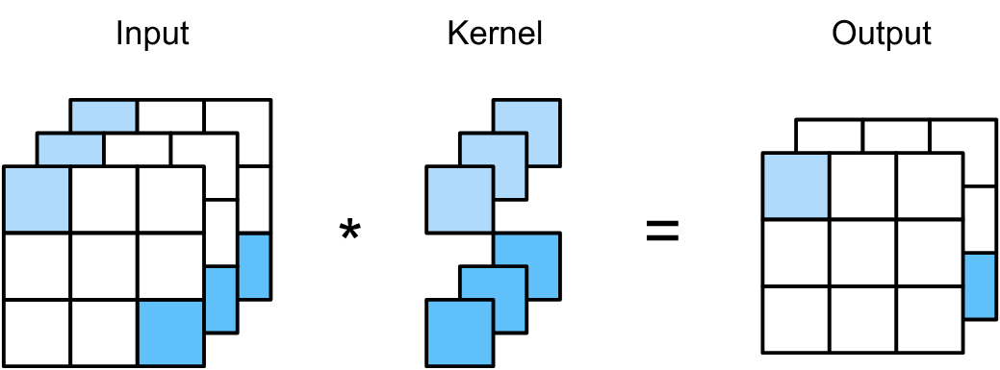
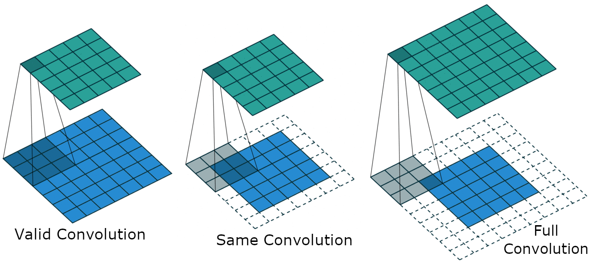

# Convolutional Networks

Convolutional neural networks (CNN) are designed to use convolution operation instead of full matrix multiplication to reflect the spatial structure of the input in deeper latent representations. CNNs are dedicated for processing grid-like data, such as 1D sequences or 2D images. Thus they have become very popular in modern Computer vision and NLP applications.

## Convolution Operation

In continuous case, convolution operation is defined as:

#### $s(t) = (x*w)(t) = \int_{-\infty}^{+\infty} x(\tau)w(t-\tau)d\tau$

where $x(\cdot)$ and $w(\cdot)$ are two functions defined on the real axis. 

Of course, in practice all the data that we work with is discretized, therefore we use the corresponding definition for functions with integer-valued arguments:

#### $s(t) = (x*w)(t) = \sum_{a=-\infty}^{+\infty} x(a)w(t-a)$

The first and second arguments of convolution operation are called the input and kernel respectively, and the output is called the feature map.
Although in practice we have finite data, we can still use the definition above assuming that the functions are zero everywhere outside a finite region for which we actually store values.

Next important definition is the generalization of convolution operation for 2D case, as it’s widely used for 2D images:

#### $s(i,j) = (I*K)(i,j) = \sum_m\sum_n I(m,n)K(i-m,j-n)$

It’s easy to see that this operation is commutative because of flipping the kernel, i.e. an equivalent definition is:

#### $s(i,j) = (K*I)(i,j) = \sum_m\sum_n I(i-m,j-n)K(m,n)$

Without flipping the kernel, we would arrive at another famous operation called cross-correlation:

#### $s(i,j) = (K*I)(i,j) = \sum_m\sum_n I(i+m,j+n)K(m,n)$

which is in fact the one used in CNNs, although it’s called convolution in this context.

Notably, discrete convolution can be implemented as a matrix multiplication, making the convolutional layer a special kind of fully-connected (linear) layer with lots of constraints on its weights. The kernel elements can be put into the rows of a matrix, extended with zeros, so that the resulting matrix is a Toeplitz matrix. Then performing convolution would be equivalent to multiplying this matrix by the flattened input vector.

## Convolutional Layer

A typical convolutional layer is made up of three stages: convolution of input with several learnable kernels in parallel, followed by a non-linear activation function (ReLU) and pooling.

Convolution introduces three key ideas to neural networks gaining privilege over traditional fully-connected models:

### Sparse interactions

Sparse connectivity or connectivity is achieved by making the kernel size much smaller than the input size. Unlike fully-connected layers, where there is a connection between each of $n$ output and $m$ input neurons, in a convolutional layer the computation of each output neuron is only affected by a small number (equal to the kernel area $k$ for non-boundary units) of neighboring input neurons. Similarly, each input neuron is connected to a small number of neighboring output units. This results in a significant reduction in both computation and memory requirements - from $O(m\*n)$ to $O(k\*n)$. 
However, a small kernel doesn’t mean a small range of interactions. We can build complex interactions between different input units by stacking multiple convolutional layers on top of each other. Moreover, size of the receptive field of a CNN unit, i.e. the number of input units affecting its computation, increases at each layer proportional to the kernel size.

### Parameter sharing

The kernel weights are shared across the input and instead of learning a separate set of kernel parameters for different locations, we learn only a single set of parameters. Thus the number of learnable weights for each convolutional layer is equal to the number of kernel elements, which is much smaller than in case of full matrix representation, since $k<<m\*n$. This is a huge improvement in both the model’s memory requirements and its statistical efficiency. 

### Translation equivariance

Due to parameter sharing, convolution becomes equivariant to translation, i.e. the output feature map is shifted by the same amount when shifting the input. This property means that after learning to detect a particular feature or object on some part of the image, CNN can detect it anywhere on the image. 

However, the last two properties may be undesirable when we want to extract different kinds of features from different parts of the input, e.g. in deeper layers of processing centered and cropped face images.

## Pooling

Pooling combines the output of several neighboring units (from a rectangular region) into a summary statistic at that location. Some famous pooling functions are max-pooling, average-pooling, L2-norm, etc. Pooling stride is usually set to the size of the pooling region, so that pooling is responsible for reducing the spatial size of the input (downsampling). Thus, pooling helps to reduce the number of parameters and computation. Moreover, pooling units are approximately invariant to small translations of the input, as well as can learn to become invariant to small rotations. Furthermore, due to the properties of downsampling and locally invariance, pooling can be useful in controlling overfitting. 

Both convolution and pooling can be helpful in handling inputs of various sizes, by adapting the convolution or pooling stride so that the first fully-connected layer always gets the same number of inputs, or by using global pooling (e.g. GAP) before the fully-connected layer to extract one unit per input channel.

Most common CNN architectures stack a few convolutional and RELU layers, followed by a pooling layer, and this pattern gets repeated until the input is shrunk spatially to a small enough size. At some point, it is common to switch to fully-connected layers. The last fully-connected layer yields the output, such as the class scores.

## Convolution and Pooling as an Infinitely Strong Prior

In machine learning problems we often use regularization to reduce the generalization error. The regularizer can be a prior probability distribution on the model parameters. The strength of the prior depends on how concentrated its probability distribution is, which can be reflected in the weight of the regularizer term. A Gaussian distribution with small variance is an example of a strong prior. 

When talking about an infinitely strong prior, we mean that it constrains some of the parameters to have a specific value. In this sense, convolutional layer can be considered as a fully-connected layer with an infinitely strong prior on its weights, since most of the weights are constrained to be zero (the corresponding Toeplitz matrix is very sparse) and the weights of one unit must be the same as those of its neighboring unit just shifted by stride (corresponding to the rows of Toeplitz matrix). Similarly, pooling can be thought of as a prior putting infinitely strong constraint that each unit should be invariant to small translations of the input.

An important inference is that convolution and pooling can cause underfitting, like any prior which is strong enough and whose assumptions about the model are not realistic enough. For example, if the precise spatial information is very relevant for the task, pooling can cause underfitting. Similarly, When it's important to incorporate features from different locations of the input, convolution may be undesirable.

Another key takeaway is that convolutional models should only be compared to other convolutional models and not to other types of models for performance. For example, it is not fair to compare a CNN to an MLP as the latter can learn even if we permute all the pixels in the image - provided enough training data.

##  9.5 Variants of the Basic Convolutional Function

In the chapters before, the typical convolution was introduced. When implementing such a convolutional layer, the definition of convolution differs slightly. In this part, the different techniques which are used in practice, are described.

### Multichannel Convolution

When implementing we need some additional properties for the convolution. We usally don't want to extract just one feauture, but many of them, such we get multiple activation maps. We also want to do this in parallel. For example, we may input a 2-D grayscale image and apply five filters in parallel, we get a 3-D tensor with a depth of five. When we want to add another convolutional layer, we have to convolute over a 3-D Tensor. This kind of data appears often. We should consider the input not as a grid of valus. It is usally a grid of vectors. A good example for that are colored images. Each pixel has a vector, describing the intensity of blue, red and green. These are also considered as channels, which leads to the multichannel convolution:

Let $Z$ be a 3-D tensor, let $V$ be our input with the same shape like $Z$ and $K$ our kernel, a 4-D tensor. The value of an output unit $Z_{i,j,k}$, with $i$=channel, $j$=row, $k$=column is given by:
$$
Z_{i,j,k} = \sum_{l,m,n} V_{l-1,j+m-1,k+n-1} K_{i,l,m,n}
$$

In this formula we sum over $l$, which refers to the channel. The variables $m$ and $n$ are valid indeces for the kernel. For simplicity, the above formula requires that $Z$ and $V$ has the same shape. In general, this is not required, we can have more or less channels in the output than on the input. This is done by using an arbitrary number of filter kernels as we can see on the picture below (https://d2l.ai/chapter_convolutional-neural-networks/channels.html).

In this case, we have to convolute over a 3-D Tensor, which leads to a 4-D tensor as kernel, since this 4-D tensor contains multiple 3-D kernels.

### Strided Convolution

Strided convolution can speed up the calculations of the convolution. If the stride is greater one, the output is shrinked. The output of a strided convolutions eqauls are standart convolution followed by downsampling. The strided convolution is faster than the downsampling. Regarding the matimatical definition, we just have to introduce a additional variable $s$ for the stride, which gets multiplied with the position in our input.

$$
Z_{i,j,k} = \sum_{l,m,n} V_{l,(j-1)*s+m,(k-1)*s+n} K_{i,l,m,n}
$$

We also can define sperate strides for different directions.

### Zero padding

When using standart convolution, the outcome shrinks by $k-1$ where $k$ is the size of the kernel. So the number of layers in the network is limited. There are mainly three diferent types of zero padding:
* Valid Convolution / no zero padding
* Same Convolution
* Full Convolution

#### Valid Convolution

Using valid convolution, only postions in the input are vistited, where the kernel fits in completly. There for each pixel of the output is influenced by the same amount of input pixels. The problem is the shrinkage of the input, which limits the number of layers in a network.

#### Same Convolution
When using same convolution, we don't have the problem of the shrinking output. The size of the output equals the size of the input. This is done by adding rows and columns of zeros such that the output size eqauls the input size. Using same convolution, the number of conyolutional layers is not limited anymore. The input pixels at the border are vistited less times than the pixels which are not at the border. This leads to thr problem that the input pixels near the border influence less output pixels as the input pixels which are not at the border. Therefore border pixels are underrepresented in the model.

#### Full Convolution
We can solve that problem by adding more zeros to out input, such that each pixel is visited equally often. The size of the output is greater than the size of the input. A disatvantage is, that the pixels at the border of the output are influenced by less input pixels than the center pixels. This makes it difficult to learn a kernel which performs well at all positions. In general, the optimal size of zero padding lies between valid and same convolution.

(Vincent Dumoulin and Francesco Visin, A guide to convolution arithmetic for deep learning, 2018.)

### Unshared Convolution

The unshared convolution is no convolution in common sense. The units are only locally connected. Each connection from output to input unit has its own weight. The difference to a fully connected layer is, that an input unit is only connected to output units in vicinity of this input unit. The advantage is, that the filter can be applied when searching for featuers which are limited in ther spatial occurence.

### Tiled Convolution

The tiled convolution is a compromise between the unshared and standart convolution. The tiled convolution used multiple kernels. The used kernel switches through while moviing through the different positions. So neighborouring ouput pixels are a result of a convolution with different kernels. The needed amount of memory is increasing by the amount of different kernels.

## 9.6 Structured Outputs

As we know from the chapters before, a convolutional network works with multiimesional tensors. This can be used, not only to solve a classification or regression task, but to output a structured object in form of a tensor. For example, with a convolutional layer, we can output a tensor, where each pixel has a vector containing probabilities for belonging to a certain class. This could be used to label every pixel in an image and use it for segmentation.
A problem which have to be considered is the shrinking size of the input. Such reductions of the size are mainly a result of pooling. To avoid such a shrinkage, we can first of all avoid pooling at all or using pooling layers with a stride of one. We also may work with a lower resolution when it's possible.
Another possibility is to upscale the image again with multiple convolutions. This can be done by produce a initial guess about the missing pixels. From there, we can use this to create a recurrent neuronal network with the same kernels in each step. In each step our initial guess gets refined.

## 9.7 Data Types

As mentioned before, there is a big bunch of data where convolutional networks can work with. The data has usually multiple channels. The examples in such datasets often has the same spatial dimensions. This is a property we often need for traditional multilayer percpetrons. With CNNs we also can handle datasets where the examples vary in thier size. This is because we convolute with one or more kernels over the data. The kernel can be applied different times depending on the size of the data. This results in a scaling of the output size.  
The scaling of the output can sometimes be a problem. In some cases the output must have a consistent size. This can be achieved by using a pooling layer, whose regions of pooling scales with the size of the input. Using such pooling layers, it is possible to construct a network where the size of the input is arbitrary, but the output of it keeps a consistent size.  
Thanks to this properties we can use CNN in many applications:  
Single channel
* Audio files
* Audio files in frequency domain
* Volumetric data like CT scans
Multi channel
* Animation data of skeletons where each channel represents the angle of one axis of one joint
* colored images
* colored video data

## Questions

### Are convolutional layers (CONV+ReLU+POOL) also equivariant to translation as convolution operation is? (Slide B.7)

This depends on whether padding is used or not. If padding is used, behavior on the border can differ if the input is translated.

### Why do we use zeroes for padding and not other values?

Other paddings are possible, but zeroes are a good choice as they do not introduce more noise. Zeroes generally mean the absence of signal.

### What if we have different input sizes to CNN and want to have output of fixed size, for example a class label? (Slide B.12)

We can use a reshape layer, global pooling, and scalable stride in convolution or pooling stages according to the input.

### How do we take advantage of having separable kernels since the kernel elements are learnt via training? (Slide B.14)

We cannot be sure whether the learnt kernels will be separable or not. Instead, we can lay the groundwork by introducing 1D convolutional layers (see MobileNet for instance).

### Is the Fourier Transform useful for the forward as well as for the backward pass?

The FFT speeds up convolution operations in general. During backpropagation, kernel weights are also updated using convolution operation, which means that FFT can be applied as well.

### Is there a guideline for which types of pooling to use?

Max pooling is the most widely used type of pooling, but it depends on the application. Guidelines exist, see the Deep Learning book by Goodfellow.

### Does the order of ReLU and pooling matter? (Slide A.8)

E.g. in case of max-pooling and ReLU the order doesn't matter, since we have equivariance, i.e. max_pool(Relu(x)) = Relu(max_pool(x)).
But in general it's common to put the non-linearity before pooling.

### Can pooling be trained?

Not by backpropagation, as there are no trainable parameters. The type of pooling is another hyperparameter.

### What kind of features are captured in earlier layers, and what are captured in later layers?

Complex features such as object parts or entire objects are recognized in deeper layers, whereas simple features such as lines, shapes and edges are extracted in the early layers.

### Is the depicted network a good representative example of CNN? (Slide A.8)

Yes, but the state-of-the-art models are very deep, e.g. ResNet has hundreds of layers. The model depth depends on the task and the kind of data we have, as well as how much data is available. Deeper models can capture more complex data distributions and are more appropriate if we have lots of training data. 

### What layers are responsible for pixels that are close to each other, and what layers are responsible for pixels that are away from each layer?

Due to convolution, the receptive field of feature maps increases as we go deeper into the network (see slide 11). Pooling layers are also helpful in incorporating information about pixels that are far apart from each other, since in contrast to convolutional layers, they produce statistical summaries rather than spatial encodings.

### Why are the Toeplitz matrices sparse? (Slide A.7)

Units in convolutional layers are sparsely connected due to quite small kernel sizes, so most entries in the Toeplitz matrices are zero.

### What are tied weights? (Slide A.12)

Kernel weights are shared across the input. Another interpretation is that changing one weight changes the other "tied" weights to the exact same value.

### Why can convolutional layers be better than fully connected layers? (Slide A.13)

Sparse connectivity leads to faster training and parameter sharing results in huge reduction in memory storage.

### How does prior help with the parameter determination?

A strong prior means that we give more weight to prior assumptions about model parameters.

### Why can convolution and pooling cause underfitting? (Slide A.20)

Convolution makes the assumption that features from distant locations of the input don't need to directly interact with each other. Similarly, pooling makes the assumption that exact spatial information is not so relevant. Therefore, both can result in increased training error if these assumptions are not realistic enough for the task at hand.

### How does L2-norm pooling work? (Slide A.15)

Instead of computing the max or average over a rectangular region, we compute the square root of the sum of squares of pixel values in that region.

### Are there any advantages to using strided CONV instead of CONV+POOL, other than performance?

Another advantage is that convolution can be trained, whereas pooling is a fixed operation without any parameters.
Notably, strided convolution has become very popular in modern VAEs and GANs often eliminating pooling layers at all.

### Is convolution with multiple channels commutative?

The commutativity property only holds if we have the same number of output channels as input channels.

### How is translation invariance obtained using max pooling?

The actual neuron that produced the max result, i.e. its exact spatial location does not matter, only that it is part of the pooling region (e.g. the upper left quadrant). This enforces approximate local invariance to small translations.

### Can we use input resizing instead of adapting the CONV or POOL stride in the network accordingly?

No, because input resizing requires interpolation or reduction, which can vary greatly depending on the method.
