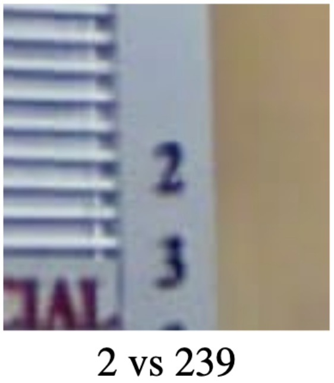

# Practical Methodology
In Practical Methodology chapter the author is talking about the methodologies needed to debug, optimize the model,as well as analyse the model's performance.
## Performance Evaluation
To analyse your model's performance, you can't use the cost function because it is not interpratable, additionally the accuracy rate is not enough.  
We need an advanced matrics to check our model performance.

The next 2 examples will show the differance between accuracy rate anad adavanced metrics.
### Ex.1 Email Spam Detection System
System has 2 kinds of mistakes:
1. Classifying legitimate message as a spam (False Positive).
2. Allow spam message to appear in the inbox (False Negative).

In case of performance evaluation the first mistake is catastrophic and needed much more to be prevented than the second one; because the harmful of missing an important email (e.g work's meeting invitation) - because it is detected as a spam message - is much more than showing a spam message in the inbox.
### Ex.2 Rare Disease Classifier
Our classifier is a binary classifier for a rare disease that happens once in a million people.

Our classifier can achieve accuracy of 99.9999%, by hard-coding the output to be non-patient for all input cases (False Negative).

Although the classifier doesn’t achieve the expected goal, it is able to pass the accuracy rate check.

so we need an advanced metrics that prevent such a problem.

### Advanced Performance Metrics
To avoid the problems mentioned in the previous examples we need at the beggining to exaplain the confusion metrics concept.
#### Confusion Metrics
|               |               | | ------------- |:-------------:| | True Positive | False Positive| | False Negative| True Negative |

1. True Positive: a truely detected/classified output (as the expected value).
2. False Positive: a wrongly detected/classified output (the expected value should be non-detected).
3. False Negative: a wrongly non-detected/non-classified output (the expected value should be detected).
4. True Negatie: a truely non-detected/non-classified output (as the expected value).

*Note: The confusion matrix can be extended to multi-label classification as well.*

#### Which Performance Matrics to Choose
There is a list of performance matrics that you can choose one of them to achieve your model's goal.
##### Performace Matrics for Classification
* FPR
* FNR
* Recall
* Precision

##### Performace Matrics for Regression
* Mean Absolute Error(MAE)
* Mean Squared Error(MSE)
* Root Mean Squared Error(RMSE)

#### Achieving our goal in *Spam Detection System*
##### False Positive Rate
False Positive Rate Matrics is a Performance Matrics that compute the rate of the falsely detected cases in your model.

To achieve the goal in our *Spam Detection System*, we should compute the rate of the False Positive output(the cases where the important emails were wrongly detected as a spam).

#### Achieving our goal in Rare Disease Classifier
##### Precision
Precision is a Performance Matrics that checks how many of the detected values were right.

##### Recall
Recall is a Performance Matrics that checks how many true events were detected.

##### PR-curve and the Trade-off
There is always a tradeoff between Precision and Recall Matrics (inversely proportional relationship). For example in our Rare Disease Classifier, the hard-coded solution of all the output is non-patient will get a good precision but zero recall. On the other hand, a hard-coded solution of all the output is patient will get a good recall but zero precision.

[source cb.csail.mit.edu]

##### F1 Score
To get a Performance Matrics that include both Precision and Recall Matrics in the same time, then you should compute the F1 score.
F1 score is the harmonic mean of the Precision and Recall Matrics.

## End-to-end System Development
To have an end to end system you need to start with a default baseline model and then increment it when is needed.

				
End-to-end System fig.1	

End-to-end System fig. 2
				

End-to-end System fig. 3

Steps to create a default baseline model:
1. In case the problem is not AI-Complete, It is preferred to implement machine learning solution (e.g Logistic Regression, SVM, etc.), that can solve the given problem and need less effort and less time for Trianing, validating, debugging, and testing. However, in case of AI-Complete problems, Deep Learning solution is needed.
2. Choose your model based on the given problem category and the input type ( FCN for fixed-sized data, CNN for images or RNN for sequence data).
3. Choose your optimization algorithm
	1. Constant Learning Rate algorithm ( SGD, SGD + Momentum)
	2. Decaying Learning Rate algorithm with decaying schedule scheme ( Linearly, fixed minimum , factor 2-10).
	3. Separate Learning Rate algorithm ( AdaGrad, RMSProp, ADAM).
4. At the begininning try to train your model without Batch Normalization to save the computation effort needed for it. However, in case that your model struggle to converge, than add Batch Normalization to your model.
5. If your dataset is not enough and you are facing underfitting in the training phase, then use Transfer Learning, Data Augmentation Techniques, and Regularizer.
6. If the trianing goes well, then validate your model with the validation dataset and tune your hyper parameters.

## Determine Wether to Gather More Data
When your model has bad preformance it is better to debug the model in systematic way before you decide to gather more data; as gathering more data is very expensive and time consuming. In some cases it is also not easy to gather more data specially with medical models for Rare diseases classification.
 
The authors suggested a systematic way that might help you to debug your model ( but any extra ideas for dubugging can be done as well).

Wether to gather data fig. 1

Wether to gather data fig. 2

1. If the training performance is bad (underfitting):
	1.  Analyse your training implementation code.
	2. Use larger network, and/or switch to Adam Optimizer (as it has more convergance advantages).
	3. As suggested by the authors, in case of still having bad trianing performance, then you need to gather more data.
2. During Evaluationg your model, if the validation performance is bad (overfitting):
	1. Hyper-tuning your model.
	2. Add Regularizer to your model.
	3. As suggested by the authors, in case of still having bad validation performance, then you need to gather more data.
3. During Testing your model, as suggested by the authors, in case of bad testing performance, then you need to gather more data.

## Analysing Your Software Defects
Sometimes it is hard to find the source of your model's problem; as the Deep Learning's models are composed of adaptive parts, if one went wrong the other parts can adapt and achieve roughly acceptable performance. 
1. Visualize/listen to the model output in action: as it helps to trigger the model's problem trather than only supervising the accuracy rate.
2. Visualize the worst mistakes: as - in classifiers that output probability for each class - tracking the expected outputs with least probability, gives you an idea why the model went wrong. 
3. Fit a tiny dataset: as doing intended overfitting by training the model with small number of samples, will let you check the ability of the model to learn already. 
4. Compare back-propagated derivatives to numerical derivatives.
5. Mintor histograms of activations and gradient.
6. 

## Hyperparameters

Hyperparameters control how the training algorithm of our model behaves, and also how the model behaves during inference. We can break them up into two categories:

- Hyperparameters which control time and memory costs of the optimization algorithm and the model inference. One such example is **batch size**, which drives up both time and memory costs of the optimization. Another is **number of units**,  which additionally also affects the runtime during inference.

- Hyperparameters that control the quality and the performance of the optimization, and of the inference. The **learning rate**, for instance, influences the size of our gradients and therefore how our model learns. Similarly, the **batch size** affects our gradients as well: it practically determines how "smooth" they become as it averages them over more than one data point.

Knowing about how hyperparameters work is benefetial: we want to keep time and memory requirements low while at the same time achieve high performances with our model. This is almost always a trade-off because our resources are limited.

### Objective of Hyperparameter Tuning

Our goal is to find the optimal solution for this trade-off. Specifically, we want to find hyperparameter values that minimize the generalization error. The secondary condition is that the values can not exceed our runtime and memory requirements.

### Manual Tuning

If we want to tune our hyperparameters manually, we need to understand how they work. So what exactly do all hyperparameters control in one way or another? This concept is called model capacity, and hyperparameters either increase or decrease it depending on its value. Model capacity consists of **representational capacity**, **cost function capacity**, and **regularization capacity**:

-   Representation capacity determines what types of functions our model can represent. Can we even learn the XOR function if our network is only a perceptron? Can we even learn to detect dogs in our input image or do we need to improve our encoder-decoder architecture so that this task is actually learnable?

-   Cost function capacity: is our learning algorithm even capable to minimize the cost or loss function we have set up? The learning algorithm needs to be able to discover functions that minimize our training cost.

-   Regularization capacity: parameters such as weight decay could block the optimization from reaching some of the functions that minimize the training cost. It would forbid our model to learn the optimal model parameters.

#### Effects of Capacity

-   A low capacity leads the model to underfit our problem, we can see this zone to the left of the red line. On the extreme end near 0, training error can be so high that it does not matter what our generalization error is. The capacity is too low to properly fit the problem even on the training set.

-   A very high capacity leads the model to overfit our problem, this zone is on the right of the red line. With growing capacity, training error decreases more and more, but in the process the generalization error moves away from us. This growing generalization error in light of low training error is called generalization gap. Our model works perfectly well on the training set, but can not generalize to unseen data.

-   Our model capacity should not be low or high, but rather optimal. It lies on exactly that spot where generalization error is lowest. *However (!)*, it should be noted that some modern deep neural networks achieve remarkable results even with enormous model capacity. The key here is to have enormous amounts of data as well.

So, our more specific goal with hyperparameter tuning is to choose parameters in such a way that the model capacity is optimal. There are different kinds of hyperparameters that do it in different ways.

#### Data Types of Hyperparameters

Hyperparameters can appear in various forms or data types.

-   A hyperparameter is either discrete or continuous. Discrete hyperparameters can only have values at specific intervals, while continuous hyperparameters of course can have any value on a given interval. Depending on the actual hyperparameter in question, a small value either has the tendency to under- or to overfit the model, and the same goes for large values.

-   Binary hyperparameters only have two states: one state has the tendency to overfit and one state has the tendency to overfit. By using this switch, we can either push the model in the direction of the underfitting or to the overfitting zone.

-   There are also hyperparameters that can only decrease model capacity, for example weight decay. The value can only be 0 or positive, which means we can only use it to push the model more to the underfitting side.

#### Effects of Hyperparameters
Examples of hyperparameters that, when made larger, can only *increase* model capacity:
- Number of units.
- Kernel size.
- Implicit zero padding.

Examples of hyperparameters that, when made larger, can only *decrease* model capacity:
- Weight decay coefficient.
- Dropout rate.

Examples of hyperparameters that need to be optimal to increase model capacity:
- Learning rate.

The learning rate is arguably the most important hyperparameter. When adjusting it, you should not think about it in terms of "larger is worse" and "lower is better" or vice-versa, you should think about it in terms of "too large or too low is bad, find the optimal value". Because it directly influences how big the gradient will be, always tune it first if you have not much time.

#### When to increase or decrease model capacity

A large training error indicates that our training algorithm is not able to find the function we want to learn, or that the model can not represent this function in the first place. We should *increase the model capacity*. If we are using regularization, we can use it less. Maybe our optimization algorithm does not work correctly or we feed the wrong target values into the cost function. In this case, we need to fix it. Maybe our model is simply too small to fit the target function, in this case we can add layers, units, increase kernel size, or make the model larger in another way.

A large test error, but small training error, is known as a large generalization gap. By adjusting our hyperparameters, we need to reduce this gap faster than the training error increases due to the very same adjustments (again, this is a trade-off). We can do this by increasing weight decay, the dropout rate or simply gathering more data.

### Automatic Tuning

Using automatic tuning, we do not need to know exactly how hyperparameters work because an algorithm will find the values that meet our goal: minimizing the validation error.

#### Grid Search

Using grid search, we first select a small finite set of hyperparameter values to explore. Then, grid search trains the model for every combination of these hyperparameter values. It then looks at the validation error to see what combination worked best. Grid search is suited for three or fewer hyperparameters, as the number of combinations can grow very large otherwise.

The exploration set (or "grid") has to be set by the developer. Usually, we choose possible values on a logarithmic scale to maximize our search space. For the learning rate, a possible set could be $\{0.1, 0.01, 10^{−3}, 10^{−4}, 10^{−5}\}$. If grid search determined one value to be promising, we can refine the search space even further by choosing a smaller scale around this value.

#### Random Search

Random search however is not aligned on a grid of hand-selected values, the values are instead chosen automatically in a randomized way. What we can choose is:

• What hyperparameters do we want to find the best value for and

• What random distribution should each hyperparameter be selected from.

A big advantage is that, practically, we can use it for more than three hyperparameters since not every combination is tried out. And we do not have to try every combination because more of the parameter space can be explored, as we do not pre-define possible values.

Another reason it is more efficient is also that it is faster in reducing the validation error if you look at the number of trials: we do not "waste" trials.

For example, let’s say we have the hyperparameters "number of units", "learning rate" and "kernel size". We look at two specific combinations on the grid to illustrate wasted trials. Here, changing the number of units does not have an effect on the generalization error. But we tried it anyway, so in some sense this trial was wasted. In random search however, in the meantime we have also randomly adjusted the learning rate and the kernel size. We are not restricted to our pre-defined grid after all. This way we have found two configurations that are even better than 0.81.  
This comes at the cost of not knowing what hyperparameter is more responsible for this reduced error.

Grid search trials:

|Units|LR|Kernel Size|Error
|--|--|--|--
|50|0.01|5|**0.81**|
|100|0.01|5|**0.81**|

Random search trials:

|Units|LR|Kernel Size|Error
|--|--|--|--
|50|0.009|3|**0.42**|
|100|0.012|5|**0.69**|

#### Model-based Optimization

Hyperparameter tuning is in essence an optimization problem itself. Therefore, to find the best hyperparameter values, one can also train a model to do so. Assuming the gradient $\frac{\partial E}{\partial h}$ of the validation error with respect to a given hyperparameter is available, this gradient can simply be followed, but most of the time this is not the case. Instead, the usual method is to use Bayesian optimization.

Bayesian optimization works by looking at past evaluations of the model, and then based on these observations it chooses the hyperparameter values to evaluate next. It does this by trying to predict the accuracy (or probability of receiving a good accuracy) based on hyperparameter values, $P(accuracy\|hyperparameters)$. The hyperparameter set that is predicted to bring the largest improvement to the generalization error is then chosen to evaluate next.

A popular library is Hyperopt, which uses the Tree Parzen Estimator (TPE), an estimator that implements Bayesian optimization.

#### Practical Example

The knowledge outlined in the previous sections is put to test using a real-life example from Goodfellow et al.

Image from Goodfellow et al. (2014): Multi-digit Number Recognition from Street View Imagery using Deep Convolutional Neural Networks.

Here, we have a subproject of Google Street View, where each house needed to be assigned a street number. A model is trained to predict a street number, given an image patch that contains one or more digits. We go through each step outlined in this chapter to show their application in this Street View example.

##### 1.  Choose the performance metric

The goal is to assign each image patch containing street numbers its corresponding digits. The model that was used gave a confidence $p(y| x)$, i.e. the probability that the input $x$ corresponds to the digits $y$.

However, for this project it was important that the accuracy was very high, i.e. that at least 98% of houses were labeled correctly. For this reason, a restriction of this transcription system was to only label houses if the model was very confident that the predicted labels were correct. A wrong prediction taints the *accuracy*, making no prediction taints the *coverage* metric.

The intuition is that users want very high accuracy because it is frustrating to be led to the wrong direction. However, it is acceptable that not every house is labeled. This is therefore a trade-off where coverage is sacrificed, because it can always be improved later. So this project used coverage as the metric to meet the threshold more often, so that the system is both very accurate and has high coverage.

The performance metric is therefore the percentage of patches where $p(y\|x) \geq t$ with threshold $t$ (0.95 in this case) and an accuracy not lower than $0.98$.

##### 2. Establish a baseline model

The baseline model is the model that should be improved on or subsequently compared to. In this case, the default model had $n$ different softmax unit to predict $n$ digits. Each softmax unit was originally trained independently to maximize the probability for one given digit, respectively. The total probability $p(y\|x)$ was obtained by multiplying the output of all units together. The improvement idea was to use one output layer instead that computes the log-likelihood of the softmax units.

At this stage, the coverage was far below 90% and the goal therefore not met. The authors needed to debug the model.

##### 3. Debug model

Image from Goodfellow et al. (2014): Multi-digit Number Recognition from Street View Imagery using Deep Convolutional Neural Networks.

Training and test error were nearly identical, which indicated that the problem was underfitting or that training data itself showed issues. They visualized the worst mistakes the model did (wrong examples with highest confidence) and found out that some patches were cropped too tightly in the processing step before. A safety margin around the crops was added, which resulted in a coverage boost of +10%.

##### 4. Adjust hyperparameters

Now, training and test error were still similar, which again indicated underfitting. Since the training data was already inspected and fixed, the only other option was adjusting the hyperparameters. The solution was to add the number of units to make the model larger.  At the end, a coverage of 95.64% was achieved at an accuracy of 98% on the Street View House Numbers (SVHN) dataset.

****  

# Questions

### For real-life tasks, it's impossible to achieve absolute zero error because of the so called *Bayes error*. How is Bayes error defined and how can it be estimated?
Bayes error is the minimum error that is possible to achieve and is analogous to the irreducible error. We can use human-level error as a proxy for estimating the Bayes error. For example the performance of a team of specialists could serve as the human-level error for the specific task.

### What techniques can be used to improve a model in case we have a large gap between the human-level error and our training error?
We could use *bias reduction* techniques, e.g. increasing model capacity, decreasing regularization, or if our model is already complex enough but still poorly performing, then we should consider collecting a larger and richer dataset.

### Consider a network outputting the probability of an event to be positive (e.g. with a single sigmoid output unit). Then we can take a threshold in range (0,1) and report a detection only when the probability is above this threshold. How does the choice of this threshold control the model's Precision and Recall metrics?
The smaller the threshold, the more likely we are to output false positives and less likely to miss detecting a positive event. Thus, the smaller Precision and the higher Recall will be. And vice versa, the bigger the threshold is, the smaller Recall and the higher Precision will be.

### How to estimate desired error rate before beginning with the project? In research, previous work on the same problem may help to estimate the error. In the real world applications, we have some ideas on how good humans are at some tasks. For instance, the street view task needs to have less than 5% error rate due to its sensitive application.

### What is the difference between performance metric and loss function? Loss functions are functions that show the model performance during the training of a machine learning model. However, metrics are used to monitor and measure the performance of a model during training and testing.

### What does the term “coverage” in the book denote? Why is the accuracy 100% if the coverage is 0?
Coverage is a performance metric, it describes the amount of samples that a ML model can cover/classify. A zero coverage means that the algorithm did not yield any result and that all samples are human-classified, therefore, accuracy=100%.

### Do you know other widely used classification metrics than confusion matrix, Precision, recall? Receiver Operator Characteristics (ROC) curves plot the false positive rates vs. true positives at various threshold settings.

### You have cited some performance metrics like Confusion Matrix, Precision, Recall and so on. Are these performance metrics suitable to be used in unsupervised learning? No, these metrics are widely applied in supervised learning models and specifically, in classification tasks. But for some unsupervised learning techniques, e.g. clustering, one could transform the problem into a supervised learning problem by preparing a data set labeled by hand for calculating the metrics.

### Consider a model that is trained to generate samples according to some data distribution (e.g. a GAN trained on human face images). What could be a good evaluation metric for this kind of task?
*Inception score*, proposed in [this](https://arxiv.org/abs/1606.03498) paper, is an example metric for evaluating the performance of such generative models.  
It evaluates both the quality and diversity of the generated images. It includes use of an extra pretrained neural network for classifying the generated images.

### When does it make sense to combine supervised and unsupervised learning methods? Often we have lack of *labeled* training data but have plenty of unlabeled data. Obviously, pure supervised approach might not give satisfactory results. In this case, we could e.g. train an *Autoencoder* model in unsupervised way on the large dataset available, thus extracting useful feature representations. The encoder part can then be extended with some additional layers (e.g. a fully-connected layer yielding the output class scores) and further trained on the smaller labeled dataset in supervised manner.

### The authors mentioned that NN research progresses rapidly and that some of the default algorithms in the book would be replaced by others soon. Now, after 5 years of publishing this book, can you prove this statement by some examples? For Computer Vision/Topological structure, Graph Neural Networks and Capsule Neural Networks are used nowadays to overcome the limitations of CNN. For sequence based input/output, Transformers/AttentionNeuralNetworks (2017), on which BERT and XLNet are based, have been successfully used. In addition, Momentum LSTM is a new technique proposed in 2020. In general, almost every task proposes its own neural network, optimization and regularization techniques in order to achieve the intended results. For this reason, novel neural networks and optimization strategies regularly appear in the research field.

### What are default optimization techniques mentioned in the book? Are they still the same in 2021? If not, what algos should we try out first? Basically, the optimization techniques, e.g. SGD with momentum, Adam and batch normalization, are still widely applied nowadays. In addition, there is progress to help apply Newton’s method.

### What default regularization techniques can we use if we have millions of training  data? Are these techniques still the same in 2021? Early stopping, dropout and batch normalization are still leading in the regularization of neural networks. Although, there are other regularization strategies that are very popular, e.g. Bagging/Ensemble Voting, Adversarial Training, Noise Robustness and L1 and L2 norms.

### In what cases can we choose unsupervised learning as default? First, when it is known and proven that the problem to tackle works better if using unsupervised learning, e.g. Natural Language Processing (NLP). Second, if the task belongs to the unsupervised learning paradigm. Third, after applying the supervised methodology, one could attempt to try out the unsupervised one to see if better results can be achieved.

### How can we decide on how much data we need to collect?
It is a good idea to monitor how the generalization error decreases with the growth of the training dataset. By plotting sich a curve and extrapolating it, we can hope to predict how much more data we would need to achieve the desired performance.

### Overall, you showed 2 cases when there is a need to collect more data, can you cite them? Case1: If the performance of the algorithm on test data is worse than on training data.
Case2: If after collecting more data and regularizing the model, we still have poor performance.

### What sectors always benefit in general from the choice of collecting more data? And what sectors do not profit from such a setting? Big internet companies with millions of users profit from gathering more data, because they have enough (labeled) data from their users at their disposal. However, in medical areas, where experiments are conducted for a long time and at high cost, it is hard to collect more data.

### If we decided to gather more data, how much data should we add? The first step is to plot the relationship between training error and generalization error and conclude the amount of data needed. Then, increase successively the size of datasets to be added, e.g. on a logarithmic base. Note that very small datasets do not improve the performance dramatically.

### Solving any task with research is known to be very time consuming and demands money and funding. When should it be considered in your diagram? At the end under the constraint that it is infeasible to get good results even after a second data collection.

### Does optimizing for different hyperparameters separately guarantee an overall optimal set of hyperparameters?
In general, no. That is why hyperparameter optimization is considered such a hard problem.

### Name some hyperparameters for which overfitting occurs when the value is large and some for which it occurs when the value is small.
An example of a hyperparameter whose very large value may cause overfitting is the *number of epochs*. And an example of a hyperparameter whose very small value may cause overfitting is regularization (e.g. weight decay) strength.

### What is the difference between *primary* and *secondary* hyperparameters in the context of automatic hyperparameter tuning?
Hyperparameter optimization algorithms have their own parameters that can be called "secondary" hyperparameters, e.g. the range of values (and the step) to be explored for each hyperparameter. So in this context, we have primary hyperparameters of the learning algorithm automatically tuned by the hyperpameter optimization algorithm, and secondary hyperparameters which should be tuned manually.

### Does the "number of epochs" hyperparameter also control the model capacity?
It doesn't control the *representational capacity* of the model, but controls its *effective capacity*, since the longer we train the better our model tends to fit the training data and eventually overfit it.

### What are some popular hyperparameter optimization packages?
Hyperopt, Ray-Tune, Optuna, etc.

### On slide 26, you showed a U-shaped curve showing how the generalization error behaves with respect to training error. This shape is feasible because the hyperparameter examined is continuous. How does the U-shaped curve change if the hyperparameter is discrete? Binary? If the hyperparameter is discrete, e.g. number of units in a layer, it is only possible to plot some points along the U-shaped curve. If the hyperparameter is binary, they can only explore two points on the U-shaped curve.

### How does the training error change when increasing the learning rate? The training error decreases and it forms a U-shaped curve if depicted with an increasing learning rate under assumption that it was chosen correctly. Otherwise, the training error strongly depends on the problem we are trying to solve, the model’s architecture and other hyperparameters beside the learning rate.

### The training error is low when the capacity is high and the test error depends on the gap between training and test error. Can you explain the idea behind error trade-off in successful neural networks models? The gap must decrease (regularization params) faster than the increase of training error.

### Who can manually tune hyperparameters? Experienced people in hyperparameter optimization or people that worked on the same project before.

### GridSearch and RandomSearch are two hyperparameter optimization algorithms that belong to the exhaustive search of space class. Can you name some other algorithms that are responsible to optimize a model’s hyperparameters? What is the clue with these algorithms in general? Besides the exhaustive search, there exists the sequential model based optimization, e.g. Bayesian Optimization (BO) and Tree-structured Parzen Estimator (TSPE). In addition, the Hyperband algorithm is an extension of the RandomSearch and Population-based training. The clue with these algorithms is that they have parameters that need to be adjusted for each model.

### Do you think that it is possible to use GridSearch for unsupervised learning tasks? Yes, but we have to get rid of the cross validation first because it requires labeled data.

### On slide 32, to which hyperparameter(s) such a logarithmic scale corresponds?  Does it have to be the same for all the hyperparameters? On slide: learning rate. No, it is not the same, e.g. hidden units hyperparameters range from the following set {50, 100, 200, 500, 1000, 2000}.

### Compare grid search and random search.
The complexity of grid search grows exponentially in the number of hyperparameters. For different experiments, grid search delivers the same result even if the values of hyperparameters are different (see slide 35). Unlike grid search, random search does not repeat experiments, it only tests a unique value for each interesting hyperparameter and reduces validation set error faster than grid search. The major benefit of grid search is that it can be parallelized even though this parallelization poses a new computational problem.

### Does it make sense in your opinion to run grid search more than once to get the best model? If yes, is this idea also applicable for random search? Yes, grid search improves its findings by running its experiments repeatedly while focusing on successful parameter sets defined from the previous GridSearch results. The same concept is also applicable for random search.

### What is the difference between hyperparameter and model parameter? The model parameters are part of the neural network model which derives from data automatically, e.g. weights. Whereby hyperparameters are parameters that are chosen manually by an expert or heuristically, they are not part of the model and do not relate directly with data but they help estimate the model parameters, e.g. the learning rate of a neural network is a hyperparameter.

### Can you explain what is the “gradient” mentioned on slide 36? Can we calculate the gradient for hyperparameters of discrete type? The gradient here is the derivative of the error during backpropagation with respect to (thousands) hyperparameters. It is not feasible to calculate this gradient for discrete hyperparameters because it will not be differentiable.

### Can you explain the terms Exploration and Exploitation as well as their relationship to Bayesian regression model? The Bayesian regression model makes an expectation on the error of the validation set when using a hyperparameter and draws the uncertainty around this expectation. Optimization using Bayesian regression models can be seen as a tradeoff between exploration and exploitation. On one hand, exploration is a searching operation where hyperparameters are chosen that yield high uncertainty leading to either a large improvement or a poor performance. On the other hand, exploitation is a refinement operation in which the model chooses a hyperparameter with which it is confident, the confidence comes from the previously seen examples because of the assumption that this hyperparameter would perform at least as well as the previous ones.

### The authors did not recommend using Bayesian Optimization in their book. Has it been widely used after 2016?
No, mainely in research and big companies like Facebook and Amazon because using it requires knowledge in Bayesian techniques, and they are time and computationally costly

### What is the benefit of randomSearch over model-based hyperparameter optimization? What has been a mitigation technique for it? Hyperparameter optimization algorithms must completely run a training experiment in order to extract any information from the experiment, unlike random search that have the opportunity to only experiment with promising hyperparameters. The proposed algorithm for mitigation can choose to begin a new experiment, freeze a running experiment that appears not so important/promising or to unfreeze/thaw a previously frozen experiment.

### What is the main idea of Bayesian hyperparameter optimization?
Bayesian optimization, in contrast to Random search and Grid search, keeps track of the previous evaluation results which are used to form a probabilistic model from hyperparameter values to a probability of achieving certain scores for the objective function.

### What if we have low test error, but after deploying the model we get bad reviews from the customer complaining about the system performance at real-time? What could be the reason and what steps should we undertake?
The possible reason could be the inconsistency between the data that we used for training/testing our model and the actual data used at inference-time. So, it would be a good idea to start collecting a richer dataset that better reflects the actual data distribution.

### When monitoring the paramter values together with their update magnitudes at each iteration, what should the relation between these values be?
As proposed by Bottou (2015), the magnitude of a parameter update over a minibatch should be around 1 percent of the parameter magnitude.

### Debugging neural networks is a tough task. Why? One reason is that we have no idea on how the algorithm should behave. Another reason is that the parts of machine learning models are adaptive and depend on each other during training, loss function, weighting and adjusting hyperparameters. If a part failed, others part do not stop, instead, they continue their calculations with false measurements.

### Cite some debugging strategies. Which debugging strategy was used in the StreetView project? 1. Visualize the model in action to look beyond quantitative performance and evaluate the output of the model. But here, make sure that good results may be misleading.
2. Visualize the worst mistakes to unveil mistakes, e.g. in data preprocessing and labels (used in the Street View project).
3. Reason about software using training and test error to detect clues in software implementations e.g. reloading a model after saving it does not work properly.
4. Fit a tiny dataset: by fitting only 1 example to the model which should classify it correctly. If it does not, use autoencoders to regenerate the same example. If it does not work, there is a problem with the software.
5. Compare back-propagated derivatives to numerical derivatives.
6. Monitor histograms of activations and gradient: tells if the units of activation functions saturate and how much they do that.

### Is it sufficient to look at the model’s output to make sure that the model works? No, because the bug is not necessarily seen from the output. Sometimes, the output looks accurate, but there are still mistakes in the model.

### What accuracy did they achieved in the street view project at google at the end?
At the end, the accuracy was 98%, greater than their intended accuracy.

### In the example project of Street View transcription system, people used a CNN with multiple output softmax units to predict a sequence of n characters. But this assumes predicting a fixed number of maximum digits in the image. Wouldn’t it be more suitable to use an RNN instead of a CNN in this case?
They could probably also use a CNN in combination with an RNN in this project. For example, a CNN encoder to get a useful feature representation, followed by an RNN decoder to output the sequence of digits. But the reason for not considering more complex models could be that the achieved performance was already acceptable enough.
